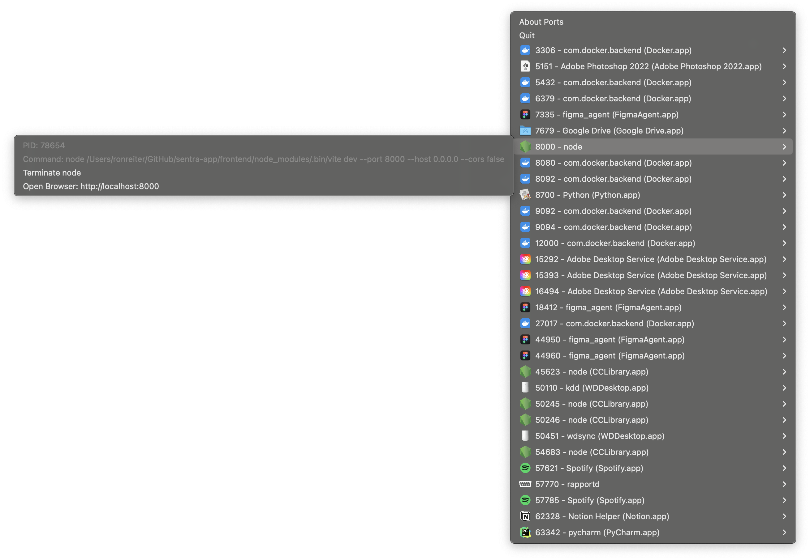

# goports – Local macOS Port Management Utility



## Table of Contents

1. [Features](#features)
2. [Requirements](#requirements)
3. [Getting Started](#getting-started)
   * [Download](#download)
   * [Building](#building)
   * [Usage](#usage)
4. [Contribute](#contribute)


`goports` runs as a macOS menu‑bar app and CLI utility that shows every
listening TCP socket (and now UDP listeners too).  IPv4 and IPv6 addresses are
handled, and the output identifies the protocol so you can distinguish
`tcp/80` from `udp/53` easily.  It's a single Go binary with no external
runtime requirements.

Whether you’re developing servers, debugging networking issues or simply
curious, goports lets you inspect, open or kill port owners without leaving
the keyboard.

---

## Features

goports exposes the same discovery engine to both a menu-bar GUI and a
command-line interface.  Highlights:

- **Real-time port monitoring** – all listening TCP sockets (and UDP
  listeners) are listed and updated every few seconds.
- **Host name resolution** — reverse DNS is performed on each address, so
  `127.0.0.1` may appear as `localhost`.
- **Application identification** — see the executable name and, when
  possible, its `CFBundleIdentifier`.  The GUI looks up a matching bundle and
  icon via Spotlight; for plain binaries we fall back to built-in PNGs for a
  handful of common tools (`ruby`, `prometheus`, `netcat`, `nxrunner`,
  `onedrive`, `rapportd`, etc.).  Icons require the `sips` tool; the code uses a
  temporary file to avoid earlier "exit status 13" problems.  Launch the GUI
  from a terminal and check stderr for `iconForBundle:` messages if something
  still goes wrong.
- **Process control** — terminate listeners directly from the menu or
  with `--kill`.
- **Activity events** — the internal API now publishes open/close events for
  ports; future GUI/CLI enhancements can consume this stream to display
  realtime activity graphs.
- **Browser integration** — `--open` or the GUI menu item launches
  `http://localhost:<port>` in the default browser.
- **Lightweight Go binary** — single executable produced with `go build`;
  legacy Python/py2app support is only retained for historical reference.
- **Configurable preferences** — a Settings submenu controls start‑at‑login
  (launch automatically when you sign in), notifications, and refresh
  interval; preferences persist in `~/.config/goports/settings.json`.

## Requirements

- macOS (apps use `lsof` and Cocoa menu bar APIs)
- `lsof` must be present on your PATH (installed by default on macOS)
- `sips` required if you want application icons in the GUI
- optional: Spotlight indexing enabled for icon resolution

## Getting Started
_Note: the CLI engine is now abstracted so ports discovery can be implemented
on non‑macOS platforms.  The application separates GUI code behind build
tags; non‑darwin builds produce a CLI-only binary that will compile anywhere.
Currently only macOS provides a working backend, but the scaffolding is in
place for Linux/Windows support._

### Download

You can download a pre‑built bundle from the `dist` directory on the
repository, for example:

\`\`\`
https://raw.githubusercontent.com/alextheberge/goports/master/dist/goports.zip
\`\`\`

Alternatively clone the repo and build locally (see **Building** below).  
Legacy Python source has been moved to `legacy/python` for historical reference; the modern code is all Go.

### Building

The project is now a pure Go application; there is no Python dependency.
Use the standard `make` targets to compile and package.

\`\`\`bash
# compile the CLI binary (output: bin/goports)
make build

# create a macOS app bundle
make build-app           # writes goports.app

# build then immediately run the bundle (GUI mode)
# the app has LSUIElement=true so no Dock icon is shown –
# look for its icon in the menu bar instead.
make run-app

# package the bundle for release
make dist                # writes dist/goports.zip
\`\`\`

Drop `goports.app` in your `/Applications` folder after building, or unzip the
archive produced by `make dist`.

> ⚠️ `make python-build` and `setup.py` are maintained only for historic
> reference; they no longer produce a usable application.

### Usage

`goports` enumerates listening sockets via a platform-specific engine.
On macOS the implementation now reads listener information via the
`sysctl` interface (`net.inet.{tcp,udp}.pcblist`) and subsequently scans
process file descriptors via `libproc`, so PIDs, names and command-line
paths are obtained without ever spawning `netstat`/`lsof`.  A short in‑memory
cache (≈1 s) avoids repeated kernel calls during rapid polling.  Netstat is
only consulted as a fallback if the syscall fails.  On Linux we likewise
parse `/proc/net/*` and then inspect `/proc/<pid>/fd` entries to map sockets
back to processes, populating PID, command line and executable name; the
native map is also cached briefly.  On Windows the backend uses the IP Helper
API (`GetExtendedTcpTable`/`GetExtendedUdpTable`) plus
`QueryFullProcessImageName` to provide equivalent native data.  In all cases,
fallback to the appropriate system tool (lsof/netstat) remains possible if
the native call fails.
The code is structured so that fully native backends (e.g. Win32 APIs) may
replace the external command dependencies later without touching rendering
logic.
The CLI output includes a ``PROTO`` column so the protocol is obvious.  When
running the GUI you will initially need macOS; non-darwin builds are CLI-
only.  Both GUI and CLI share the same engine; items appear in the menu bar
and the table automatically.

Behaviors you get “for free”:

* reverse DNS on local addresses (`127.0.0.1` → `localhost`,
  bracketed IPv6 addresses are also handled)
* process bundle ID and icon lookups when available
* GUI menu‑bar titles now include the PID(s) and a short command‑line
  snippet for each listening process, making it easy to identify and
  drill into the responsible application without opening a submenu

#### CLI flags

Several new options make scripting and interaction more flexible.  (Note
that the `PROTO` and `FAMILY` columns are shown when no filters are
applied.)

```sh
--gui                 # launch menu‑bar app (default)
--watch, -w           # refresh every N seconds
--kill PORT           # kill processes on PORT (any protocol)
--kill-name SUBSTR    # kill matching process names
--kill-bundle SUBSTR  # kill matching bundle identifiers
--signal NAME         # signal to send (TERM, KILL, etc.)
--proto tcp|udp       # filter displayed protocols
--name SUBSTR         # filter by process name
--bundle SUBSTR       # filter by bundle identifier
--family IPv4|IPv6    # filter by address family
--json                # output JSON
--csv                 # output CSV
--open PORT           # open http://localhost:PORT in browser
```

#### GUI Settings

When running in GUI mode a "Settings" submenu is available.  In addition to
login items and interval controls you can now:

* **Show TCP/Show UDP** checkboxes – toggle visibility of each protocol
  from the Settings menu; useful when you only care about one type.
* **Filter…** — show only menu items matching a case-insensitive substring;
  the current filter is displayed in the menu and persisted across launches.
* **Enable Notifications** checkbox appears in each port submenu, allowing
  you to mute alerts for specific ports.  Settings are remembered between
  sessions.
* **Use native discovery only** checkbox – when checked the GUI will refrain
  from invoking `lsof` or other helper binaries and rely purely on built-in
  platform APIs (sysctl/netstat plus a `libproc` fd scan on macOS, `/proc` on
  Linux, or IP Helper APIs on Windows).  The results are cached and the path
  is lightweight and free of external dependencies.

  **Why enable this mode?**

  * You need a single, self-contained binary with **no external command
    dependencies** – useful in containers, sandboxes, signed/hardened builds,
    or on systems that might not even have `lsof` installed.
  * Performance/battery.  Repeatedly shelling out to `lsof` can be expensive;
    the native path is faster and less CPU-intensive during frequent polling.
  * Cross-platform testing.  Linux and Windows discovery currently only
    exist in native mode, so the flag lets you exercise those backends.

  **What are the downsides?**

  The kernel may refuse to expose process metadata.  On macOS this happens
  under SIP, sandboxing, or when running as an unprivileged user; on Linux
  permissions can block `/proc/<pid>/fd` inspection.  In these cases the
  native backend will return listeners with `Pid == 0` and blank command
  lines/bundle IDs.  There is no workaround without invoking `lsof`, which is
  why the checkbox is available – leave it off if you want rich PID/cmdline
  information.
* The menu bar icon automatically switches between light and dark variants
  depending on your macOS appearance.
* Descriptive tooltips on menu items improve accessibility for assistive
  technologies such as VoiceOver.

The following preferences are persisted across launches:

* **Start at Login** – toggles whether goports is added to your macOS login
  items.  Enabling will attempt to create/delete a System Events login item
  via AppleScript; failures are non‑fatal.
* **Enable Notifications** – when on, the menu will send native notifications
  for ports opening and closing.  Turning it off silences those alerts.
* **Refresh interval** – click repeatedly to cycle the polling interval
  between 5, 10 and 15 seconds; the current value is shown in the menu label.

These settings are stored in `~/.config/goports/settings.json`.

* `--gui` — launch the menu‑bar GUI (default when no flags are provided).
* `--native` — avoid calling external tools (like `lsof`); use built-in
  platform APIs only.  See the discussion above about native discovery
  limitations: metadata may still be missing if the kernel refuses to expose it.
  The environment variables `GOPORTS_DEBUG=1` and `GOPORTS_FAKE_SYSCTL=1`
  can be used to diagnose or simulate failures when running from a terminal.
* `--watch`, `-w` — refresh the CLI output every 5 seconds.
* `--kill <port>` — terminate all processes listening on `<port>`
  (any protocol).
* `--kill-name <substr>` — terminate processes whose command name contains
  `<substr>`.
* `--kill-bundle <substr>` — terminate processes whose bundle identifier
  contains `<substr>`.
* `--signal <name>` — specify signal to use for kills (TERM, INT, KILL,
  etc.).
* `--open <port>` — open `http://localhost:<port>` in the default browser.

Examples:

```bash
# show a one‑shot table of current ports (proto column added)
./bin/goports
```

\`\`\`bash
# show a one‑shot table of current ports
./bin/goports

# continuously update the table until interrupted
./bin/goports --watch

# kill whatever is bound to 8080
./bin/goports --kill 8080

# open a local web server on 3000
./bin/goports --open 3000

# start the GUI explicitly (normally invoked by double-clicking goports.app)
./bin/goports --gui
\`\`\`

The GUI mode is also the default when you launch `goports.app` from Finder.

### Contribute

Feel free to open issues or PRs.  The implementation lives under `internal/` and
is intentionally small — adding new features such as cross-platform support,
stats collection, or UI polish is straightforward.
